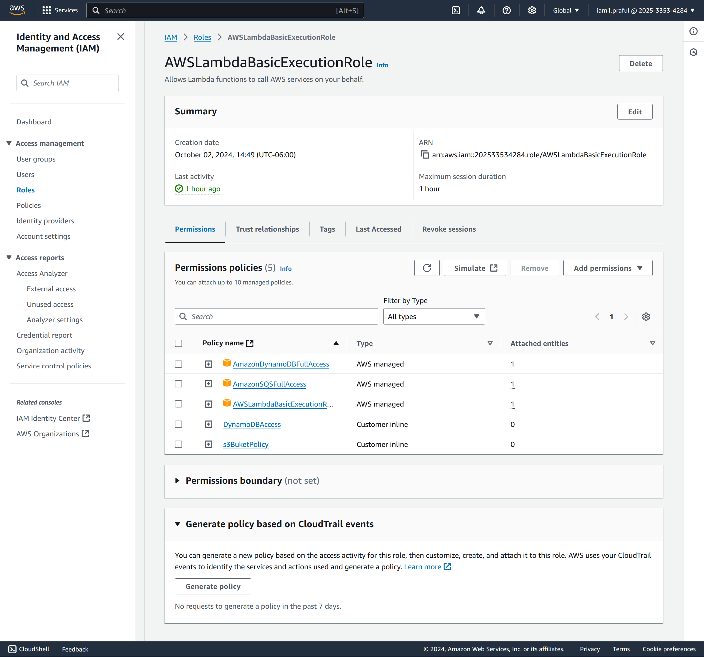

# 👉 AWS Project: AWS Serverless Prafuls resume download Web Application

This project leverages AWS serverless services to provide resume download functionality and a visitor counter for a portfolio website. The frontend includes various JavaScript libraries for animations and interactive components, while the backend uses AWS Lambda and DynamoDB to deliver dynamic functionalities.

## 👉 [📝 Follow my detailed Blog here ](https://praful.cloud/aws-project-aws-serverless-prafuls-resume-download-web-application)

## Solution Diagram:AWS Serverless Architecture

## Objective: To implement serverless features to the resume web app
# Resume Web Application

# Feature 1 - Resume Download 

# Feature 2 - Visitors counter

## Table of Contents
- [Introduction](#introduction)
- [Project Structure](#project-structure)
- [System Design Overview](#system-design-overview)
- [Infrastructure Setup](#infrastructure-setup)
  - [IAM Role Setup](#iam-role-setup)
  - [Lambda Function Setup](#lambda-function-setup)
  - [API Gateway Setup](#api-gateway-setup)
- [Resume Download Functionality](#resume-download-functionality)
  - [Implementation Overview](#implementation-overview)
  - [S3 Configuration](#s3-configuration)
  - [API Gateway-Lambda Integration for Resume Download](#api-gateway-lambda-integration-for-resume-download)
- [Visitor Counter Functionality](#visitor-counter-functionality)
  - [Implementation Overview](#implementation-overview)
  - [DynamoDB Configuration](#dynamodb-configuration)
  - [API Gateway-Lambda Integration for Visitor Counter](#api-gateway-lambda-integration-for-visitor-counter)
- [Security Measures](#security-measures)
- [Budget Considerations](#budget-considerations)
- [Deployment Diagram](#deployment-diagram)
- [Final Testing & Validation](#final-testing--validation)

---

## Introduction
This project demonstrates how to build a serverless web application with a Resume Download Functionality and Visitor Counter using AWS services. The primary focus is on leveraging API Gateway, Lambda Functions, S3, DynamoDB, and IAM roles. This system ensures that the infrastructure operates efficiently within the AWS Free Tier limits and maintains a budget of $10/month for all AWS resources.

## Project Structure

### Frontend
- **HTML/CSS/JavaScript**: Basic structure and interactivity.
- **Bootstrap**: For responsive design.
- **Google Fonts**: For custom fonts.
- **JavaScript Libraries**:
  - **Typed.js**: Adds typing animations.
  - **PureCounter.js**: Implements a dynamic visitor counter.
  - **AOS.js**: Enables scroll animations.
  - **Swiper.js**: Provides a testimonial slider.

### Backend
- **AWS Lambda**: Serverless functions for handling resume downloads and visitor counting.
- **AWS API Gateway**: Exposes endpoints for Lambda functions.
- **AWS DynamoDB**: Stores visitor counts and increments with each visit.
- **AWS S3**: Stores the downloadable resume PDF file.

### Cloud Infrastructure & Security
- **AWS IAM**: Manages roles and policies for Lambda access to S3 and DynamoDB.
- **AWS CloudWatch**: Logs and monitors Lambda function execution.
- **AWS WAF (Optional)**: Provides additional security for API Gateway endpoints.

### Version Control & Project Management
- **Git**: Version control system.
- **GitHub**: Project hosting and collaboration platform.

### Scripting
- **Python**: Language for Lambda functions handling resume downloads and visitor counter logic.
- **Boto3**: AWS SDK for Python, used to interact with AWS services (S3, DynamoDB).

### Deployment & Hosting
- **AWS Free Tier**: Ensures usage remains within the AWS Free Tier limits by optimizing Lambda, API Gateway, S3, and DynamoDB usage.

## System Design Overview
The architecture is designed to provide serverless, scalable, and cost-effective functionality. It uses Lambda for backend logic, API Gateway to expose endpoints, and DynamoDB for storage.

## System Architecture

-  The architecture consists of:

-  Frontend: A simple HTML/Bootstrap-based web page hosted via a static site generator (e.g., AWS S3 or EC2).

-  Backend Services: Lambda functions that handle:

-  Resume Download: Fetching the resume from an S3 bucket and allowing the user to download it.

-  Visitor Counter: Logging visits in a DynamoDB table and returning the visitor count.

## Core AWS Services Used:

- S3: Stores the resume PDF.

- Lambda: Handles the backend logic (fetching the resume and tracking visitor count).

- API Gateway: Exposes API endpoints for Lambda functions.

- DynamoDB: Stores visitor count.

- IAM Roles: Manages access permissions.

## Infrastructure Setup

### IAM Role Setup
1. Create an IAM role for Lambda functions with permissions for:
   - S3 (for resume storage)
   - DynamoDB (for visitor counter)
   - AmazonS3ReadOnlyAccess: Allows Lambda to read from the S3 bucket.

   - AmazonDynamoDBFullAccess: Allows Lambda to interact with DynamoDB.

   - AWSLambdaBasicExecutionRole: Grants Lambda access to CloudWatch for logs.

2. Attach policies for specific actions on the S3 bucket and DynamoDB table.

### Lambda Function Setup
1. **Resume Download Function**: Allows users to download the resume PDF from S3.
2. **Visitor Counter Function**: Increments a visitor count in DynamoDB and retrieves the updated count.

### API Gateway Setup
1. Configure REST API endpoints for both Lambda functions.
2. Set up integrations with Lambda functions, using path-based routing for `resume/download` and `visitor/count`.

## Resume Download Functionality

### Implementation Overview
This functionality enables users to download the resume PDF from an S3 bucket via an API Gateway endpoint.

### S3 bucket Configuration to store the resume pdf files
1. Create an S3 bucket to store the resume file.
2. Upload the resume PDF with appropriate permissions for Lambda access.

### S3 bucket to upload a code and host a static webapp

Static webapp URL: 

### Lambda Function Setup
- Steps to Create Lambda Function for Resume Download:

- Create Lambda Function:

- Go to AWS Lambda and click "Create Function."

- Choose the "Author from scratch" option.

- ame the function ResumeDownloadFunction.

- Choose the runtime (Python 3.9 or Node.js as per your choice).

- Set the IAM role to the one you created (Lambda-Resume-Download-Role).

# Lambda Function: Resume Download Handler

This Lambda function downloads a resume PDF from an S3 bucket and returns it as a binary stream for download.
- Set Environment Variables:

- S3_BUCKET_NAME: Your S3 bucket name.

- RESUME_KEY: The key (path) to your resume PDF file in S3.

- Steps to Create Lambda Function for Visitor Counter:

### API Gateway-Lambda Integration for Resume Download
1. Set up an API Gateway endpoint `/resume/download`.
2. Integrate this endpoint with the Lambda function responsible for fetching the resume file from S3.

## Visitor Counter Functionality

### Implementation Overview
This feature tracks the number of visitors to the site by incrementing a count stored in DynamoDB.

### DynamoDB Configuration
1. Create a DynamoDB table with a primary key for storing the visitor count.
2. Use an `UpdateItem` operation in the Lambda function to increment the count on each visit.

- Create a DynamoDB Table:

- Go to DynamoDB in the AWS Console.

- Create a table called VisitorCounter.

- Set id as the partition key.

- Prepopulate the table with an item:

### API Gateway-Lambda Integration for Visitor Counter
1. Set up an API Gateway endpoint `/visitor/count`.
2. Integrate this endpoint with the Lambda function that updates and retrieves the visitor count.

## Security Measures
1. **IAM Roles**: Grant limited permissions to Lambda functions.
2. **API Gateway Authorization**: Set up authorization if needed for additional security.
3. **CloudWatch Monitoring**: Track Lambda execution logs, errors, and metrics.
4. **AWS WAF (Optional)**: Apply a Web Application Firewall to API Gateway endpoints for added protection against web-based attacks.

## Budget Considerations
- By leveraging the **AWS Free Tier**, costs can be minimized with free usage allowances for Lambda, API Gateway, S3, and DynamoDB.
- Monitor AWS usage to ensure operations remain within free-tier limits.

## Deployment Diagram
Here is an overview of the architecture deployment:

- **Frontend**: HTML/CSS/JavaScript on S3 and CloudFront (for caching).
- **API Gateway**: Connects frontend with backend Lambda functions.
- **Lambda Functions**: Handles backend logic.
- **DynamoDB**: Stores visitor count.
- **S3**: Stores resume files.

## Final Testing & Validation
1. Test the resume download functionality by hitting the `/resume/download` endpoint.

# Verify that the downloaded resume pdf opened successfully

2. Test the visitor counter functionality by hitting the `/visitor/count` endpoint.

3. Monitor CloudWatch logs for any errors or performance issues.

The /visitCount endpoint calls the Lambda function, which increments and returns the updated visitor count.

---

**Developed by Praful Patel**  
[🔗 GitHub Project Repo Link](https://github.com/prafulpatel16/prafuls-portfolio-webapp)

### Resume Section: Projects
# AWS Serverless Resume Web Application
Description: Developed a serverless web application leveraging AWS services to provide resume download functionality and a visitor counter for tracking engagement on a portfolio website. Designed for scalability, cost-effectiveness, and operational efficiency using Terraform for Infrastructure as Code (IaC) automation.

# Key Responsibilities and Contributions:

- Architected Serverless Solution: Designed a serverless architecture using AWS Lambda, API Gateway, S3, and DynamoDB, ensuring high availability, automatic scaling, and efficient resource utilization.

- Implemented Infrastructure as Code (IaC): Automated deployment with Terraform, improving consistency, reducing manual setup time, and facilitating reproducible environments for deployment.

- Resume Download Functionality: Configured an S3 bucket to store the resume PDF, making it accessible via a Lambda function triggered by API Gateway, enhancing user experience with real-time download capability.

- Visitor Counter with DynamoDB: Established a visitor counter using DynamoDB to track site traffic. Developed Lambda logic to increment and retrieve visitor counts, enabling dynamic visitor statistics on the site.

- API Gateway Integration: Set up RESTful endpoints via AWS API Gateway to expose Lambda functions, enabling secure access to backend services and improving application reliability and performance.

- Managed IAM Security: Created secure IAM roles and policies to restrict Lambda access to only necessary resources (S3 and DynamoDB), ensuring application security and adherence to least-privilege principles.

- Monitoring & Logging: Integrated CloudWatch for monitoring and logging Lambda functions, identifying performance bottlenecks, and tracking API usage to improve application reliability.

## Key Duties:

- Deployed Serverless Web Application on AWS: Designed and implemented a portfolio web application with resume download and visitor counter functionalities, using AWS serverless services and ensuring seamless user interactions.

- Automated Infrastructure with Terraform: Wrote Terraform scripts to manage AWS resources, creating a fully automated and version-controlled infrastructure deployment pipeline.

- Developed REST APIs with API Gateway and Lambda: Configured API Gateway endpoints integrated with Lambda for delivering fast, cost-effective backend responses without server maintenance.

- Optimized Security and Resource Access: Defined IAM roles and policies to enforce least-privilege access, securing interactions between Lambda, S3, and DynamoDB.

- Monitored and Enhanced Application Performance: Set up CloudWatch logging and metrics for Lambda functions to analyze usage patterns, optimize API responses, and ensure resource cost efficiency.

## Technical Skills 
- AWS: Lambda, API Gateway, S3, DynamoDB, IAM, CloudWatch
- Infrastructure as Code (IaC): Terraform
- Languages: Python (Lambda functions), HCL (Terraform scripting)
- APIs: REST API development and integration with AWS services

## 👉 [📝 Follow my detailed Blog here ](https://praful.cloud/aws-project-aws-serverless-prafuls-resume-download-web-application)

## 🌐 Follow my Cloud/DevOps Tech Content and Connect

- [🌐 Website](https://www.praful.cloud)
- [💼 LinkedIn](https://linkedin.com/in/prafulpatel16)
- [🐙 GitHub](https://github.com/prafulpatel16/prafulpatel16)
- [📺 YouTube](https://www.youtube.com/@prafulpatel16)
- [✍️ Medium](https://medium.com/@prafulpatel16)
- [📝 Dev.to](https://dev.to/prafulpatel16)
